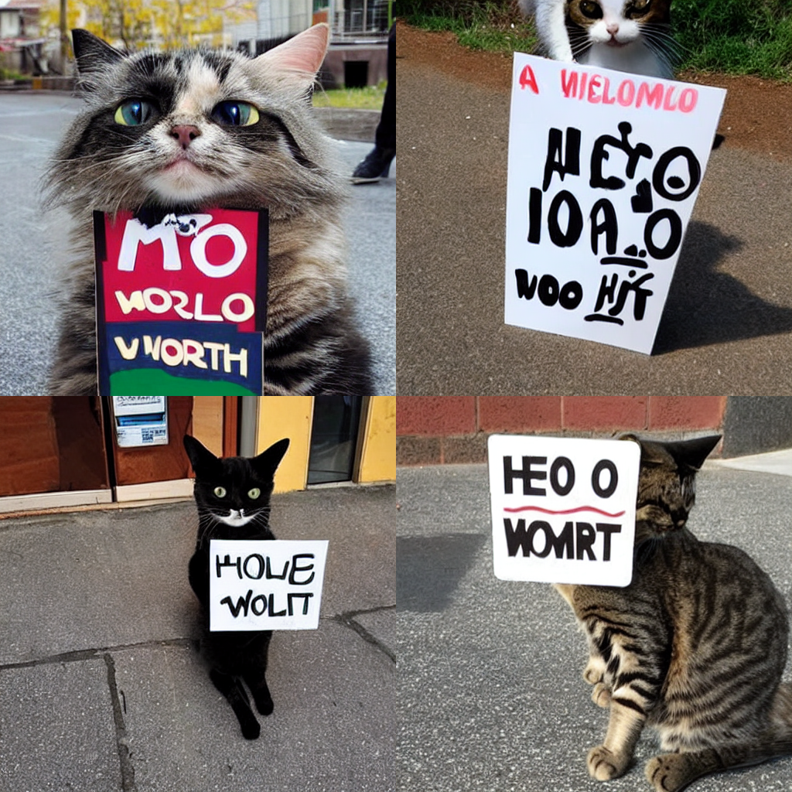

# Text-Conditional Image Generation: Fine-Tuning Stable Diffusion on MARIO Dataset

This repository contains the implementation and experiments for fine-tuning a Stable Diffusion model on the **MARIO10M** dataset for text rendering tasks. The project investigates the performance of LoRA-based fine-tuning techniques and introduces potential improvements through **OCR-based loss** for enhanced text generation quality.

---

## 🚀 Project Overview

This project aims to improve text rendering capabilities in text-to-image generation models. We fine-tune **Stable Diffusion** using the MARIO10M dataset and explore methods like:
- **LoRA Stable Diffusion** for lightweight fine-tuning.
- **Text-Masking Techniques** to enhance focus on textual components.

Extensive Work to be done:
- Proposal of **OCR-based Loss** for stronger supervision of text generation.

Despite initial challenges, this project contributes valuable insights and opens directions for further improvements in text-to-image generation tasks.

---

## 📁 Dataset

We utilize the following datasets from **TextDiffuser**:
- **MARIO10M**: First 50k samples used for fine-tuning.
- **MARIOEval/TMDBEval500**: A benchmark dataset for evaluating text rendering quality.

For more details, refer to the original MARIO dataset paper [here](https://arxiv.org/abs/2307.09708).
Implementation Details are contained in /Dataset/README.md.

---
## 🛠️ Usage

### Training 

Parameters:
- **Model**: Stable Diffusion v1.5 (Hugging Face Diffusers)
- **Training Range**: First 50k of MARIO10M
- **Batch Size**: 8
- **Epochs**: 5
- **Learning Rate**: 1e-4 ~ 1e-6 (constant schedule)
- **LoRA Rank**: 4
- **Precision**: Mixed FP16
  
Run the following command for training:
```bash
accelerate launch --mixed_precision="fp16" train_text_to_image_lora.py \
  --pretrained_model_name_or_path="runwayml/stable-diffusion-v1-5" \
  --dataset_name="mario10m" \
  --caption_column="caption" \
  --resolution=512 --random_flip \
  --train_batch_size=8 --num_train_epochs=5 \
  --checkpointing_steps=5000 --learning_rate=5e-06 \
  --lr_scheduler="constant" --lr_warmup_steps=0 \
  --seed=42 --output_dir="sd-texted-model-lora" \
  --gradient_accumulation_steps=3 \
  --validation_prompt="a photo of a cat holding a sign saying hello world" \
  --report_to="wandb"
```

Example GIF examples along training:
<p align="center">
    
    
    
</p>

### Inference
Inference Baseline Images:
open folder "StableDiffusion" ---> run Example_Run.py to generate baseline images

Inference Lora-Finetuned Images:
1. Follow the instruction on "https://github.com/huggingface/diffusers/blob/main/examples/text_to_image/README.md" to install the dependencies
2. open the "diffuser_docs" folder ---> use "inference.py" to generate images

If failed, then try below:

copy and paste all the files inside the "diffuser_docs" folder to "diffusers\examples\text_to_image" and try running there.

### Evaluation
Please refer to the /Evaluation/README.md for more detail

---

## 📸 Example Results
Below are qualitative results on the prompt “a photo of a cat holding a sign saying hello world”:
<p align="center">
    
    
    
</p>

---

### 📊 Quantitative Results

| Model                          | FID ↓       | CLIPScore ↑ | OCR Precision ↑ | OCR Recall ↑ | OCR F1 ↑ | OCR Accuracy ↑ |
|--------------------------------|-------------|------------|-----------------|--------------|----------|----------------|
| Stable Diffusion               | **115.61**  | **0.3199** | **0.0528**      | **0.0569**   | **0.0548** | **0.0025**      |
| LoRA Stable Diffusion          | 129.37      | 0.3050     | 0.0267          | 0.0357       | 0.0306   | 0.0006         |
| Text-Enhanced LoRA Stable Diffusion | 120.75  | 0.3007     | 0.0296          | 0.0340       | 0.0317   | 0.0013         |

The **text-masking technique** failed to enhance performance due to insufficient supervision for text components.


## 🧪 Proposed OCR-Based Loss (Extensive Work)

To address the failure of models to render coherent textual content, we propose an **OCR-based loss** that introduces additional supervision specifically for text components in images. The loss combines a standard image reconstruction loss with a text-specific loss derived from OCR predictions.

The proposed loss is defined as:

\mathcal{L}{\text{OCR}} = \lambda \cdot \mathcal{L}{\text{recon}} + (1 - \lambda) \cdot \mathcal{L}_{\text{text}}


\[
\mathcal{L}_{\text{OCR}} = \lambda \cdot \mathcal{L}_{\text{recon}} + (1 - \lambda) \cdot \mathcal{L}_{\text{text}}
\]

Where:
- \( \mathcal{L}_{\text{recon}} \): Standard image reconstruction loss (e.g., L2 or perceptual loss).
- \( \mathcal{L}_{\text{text}} \): Cross-entropy loss for OCR-detected text predictions.
- \( \lambda \): Balancing weight (e.g., \( \lambda = 0.8 \)) to prioritize text supervision.

#### Implementation Details
1. **OCR Detection**: Text regions are extracted from generated images using an OCR tool (e.g., Tesseract or PaddleOCR).
2. **Text Loss**: The detected text content is compared against the ground-truth caption using a text-based loss, such as cross-entropy.
3. **Balancing Factor**: The weight \( \lambda \) controls the trade-off between image quality and text accuracy.

The proposed loss encourages the model to render accurate text while maintaining overall image quality.

---

### 🔍 Evaluation and Future Directions

While the current results indicate challenges with text masking strategies, the addition of the **OCR-based loss** offers a promising solution. Future work will focus on:
1. Integrating the OCR-based loss into the training pipeline.
2. Experimenting with different OCR tools for robust text extraction.
3. Optimizing the balancing weight \( \lambda \) to achieve the desired trade-off.
4. Expanding the dataset to include larger subsets of **MARIO10M** for better generalization.

---

##🤝 Acknowledgments
- MARIO dataset and TextDiffuser authors.
- Hugging Face community for Diffusers and Accelerate libraries.

📨 Contact

For questions or collaborations, feel free to reach out to:
	•	Name: Michael Yuan
	•	Email: michaelyuan@cs.toronto.edu
	•	GitHub: MichaelYuan2

